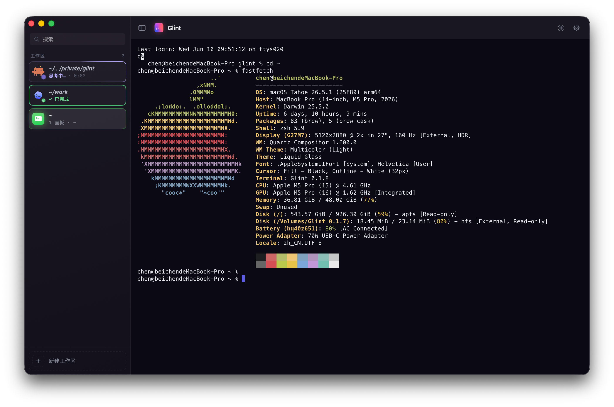
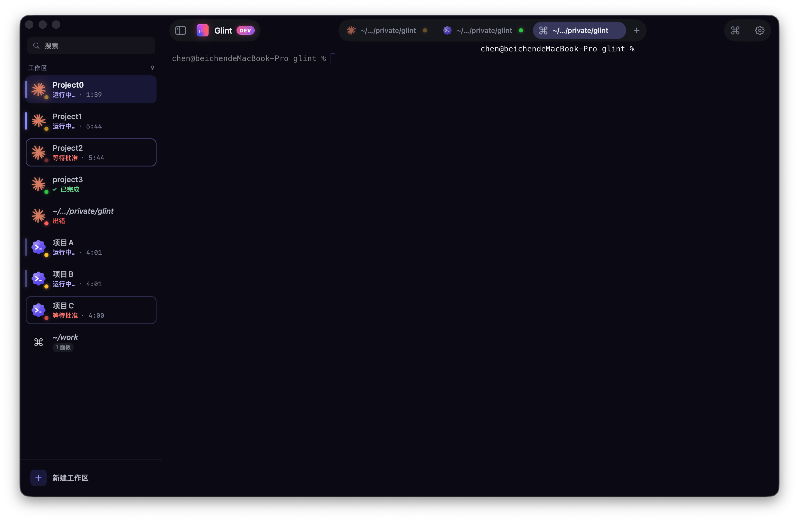

# Glint

A polished macOS terminal made for AI agents. SwiftUI + AppKit, with [Ghostty](https://ghostty.org) under the hood.





## Install

### Homebrew (recommended)

```bash
brew tap dante-teo/tap
brew install --cask glint
```

### Manual Download

Grab the latest `Glint-x.y.z.dmg` from the [Releases](https://github.com/dante-teo/glint/releases) page, mount it, and drag `Glint.app` into `/Applications`.

If macOS refuses to open it with "developer cannot be verified", run once:

```bash
xattr -dr com.apple.quarantine /Applications/Glint.app
```

The Homebrew Cask does this automatically.

## Appearance

Glint supports Auto, Light, and Dark appearance modes. Auto follows macOS and keeps the app chrome and Ghostty terminal colors in sync. Liquid Glass chrome and terminal translucency are configurable from Settings.

Glint bundles Barlow for app UI and DepartureMono Nerd Font for new terminal defaults, so fresh installs do not depend on fonts installed in Font Book.

Developer notes and regression checks live in [docs/appearance.md](docs/appearance.md).

## Agent Activity and Integrations

The sidebar's Activity mode collects approvals, failures, running turns, compaction, and unread completions across every workspace. Select an item to jump to its exact tab and pane; details are available by keyboard or click without relying on hover.

Glint accepts its original `{pane, hook, agent}` hook messages and a replay-safe, versioned event envelope for newer integrations. The protocol, lifecycle behavior, and compatibility guarantees are documented in [docs/agent-integrations.md](docs/agent-integrations.md).

## App and Agent Icons

The app bundle icon is a conventional macOS `AppIcon.appiconset` under `Glint/Resources/Assets.xcassets`; selectable Dock icon presets are generated from the portrait sources in `AppIconSource/`. See [docs/appearance.md](docs/appearance.md#app-icon-packaging) before changing app icon resources.

Agent status icons are bundled in `Glint/Resources/Assets.xcassets`. Animated status assets are 128x128 transparent APNGs stored as `.png` files inside `.dataset` folders; compact marks are 24x24 and 48x48 rasters inside `.imageset` folders.

Glint currently ships agent status integrations for Claude Code, Codex, OpenCode, and Oh My Pi.

Oh My Pi uses a single pixel pi character family, `OhMyPi*` / `OhMyPiMark`.

Regenerate the Oh My Pi family with:

```bash
python3 scripts/generate_ohmypi_pixel_pi_icons.py
```

The generator updates the asset catalog and writes a visual contact sheet to `design/ohmypi-pixel-pi-icons/contact-sheet.png`. The Oh My Pi mascot should remain visibly based on the pi symbol while changing body, face, limb, expression, or silhouette across states.

## Upgrade & Uninstall

```bash
brew upgrade --cask glint
brew uninstall --cask glint
```

## License

MIT - see [LICENSE](LICENSE).
